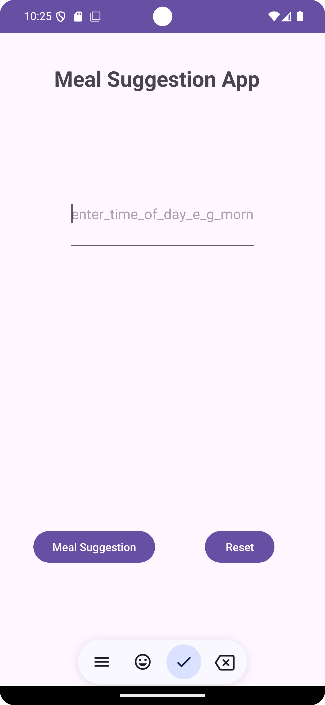
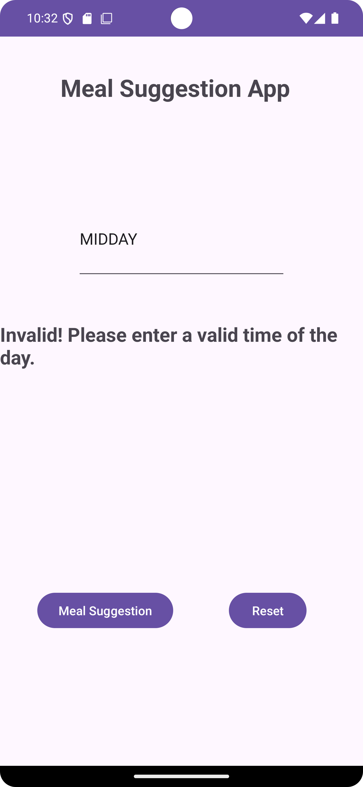
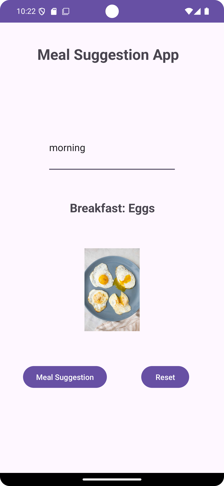

# IMAD-MEAL-ASSIGNMENT
STUDENT NAME : DALIAN NAVECK FRANSEL MATSIKA 
STUDENT NUMBER : ST104923476

My application is there to helps you as a user decide what to eat based on your preferences and what you will inputs eg."morning" it will output a breakfast meal. 

github code : https://github.com/Dalianmatsika/IMAD-MEAL-ASSIGNMENT.git
PLEASE MARK THE MASTERS NOT THE MAIN !!

youtube link : https://youtu.be/28j385sjDT0

FIRST STEP 
The user will input the time of the day which could be "Morning,Afternoon of Dinner"

SECOND STEP
The App will determine and output the appropriate mean type according to the time provided

THIRD STEP 
The App also includes Error handling and it will provide a feedback when an Error takes place 

Screenshots:
 
 

